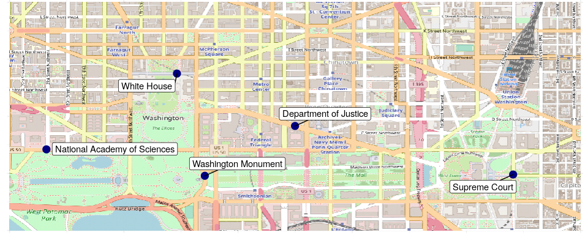

tidygeocoder demo
================

``` r
library(dplyr)
library(tidygeocoder)

# Make a tibble of addresses in DC
dc_addresses <- tribble( ~name,~addr,
       "White House", "1600 Pennsylvania Ave Washington, DC",
       "National Academy of Sciences", "2101 Constitution Ave NW, Washington, DC 20418",
       "Department of Justice", "950 Pennsylvania Ave NW, Washington, DC 20530",
       "Supreme Court", "1 1st St NE, Washington, DC 20543",
       "Washington Monument", "2 15th St NW, Washington, DC 20024"
                           )

# Geocode the addresses with the US Census geocoder
coordinates <- dc_addresses %>%
  tidygeocoder::geocode(addr)
```

Reference:
<https://www.linkedin.com/pulse/plot-over-openstreetmap-ggplot2-abel-tortosa-andreu/>

Pull OSM map data for DC. Use coordinates pulled from the OSM map web
gui

``` r
library(OpenStreetMap)

# Use this map to pick coordinates for open_map
# https://www.openstreetmap.org/export#map=14/38.8982/-77.0251  

# Get DC Map
dc_map <- openmap( c(38.905,-77.05),c(38.885,-77.00))
dc_map.latlng <- openproj(dc_map)
#dc_map.latlng <- openproj(dc_map, projection = "+proj=longlat +ellps=WGS84 +datum=WGS84 +no_defs")
```

Plot our points on our DC map

``` r
library(ggplot2)
library(ggrepel)
  
autoplot(dc_map.latlng) +
  geom_point(data=coordinates, aes(x=long, y=lat), color="blue", size=3, alpha=1) +
  geom_label_repel(data=coordinates,
        aes(label=name,x=long, y=lat),show.legend=F,box.padding=.5) +
  xlab("long") + ylab("lat")
```

<!-- -->
